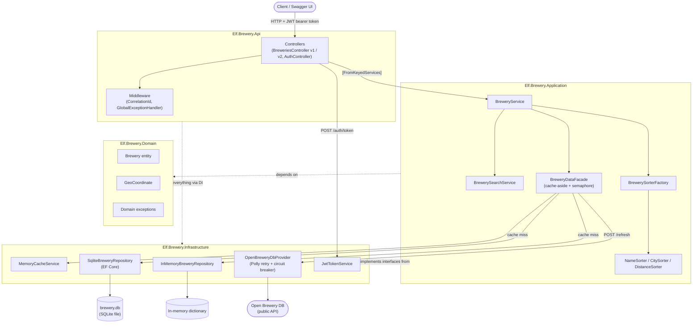
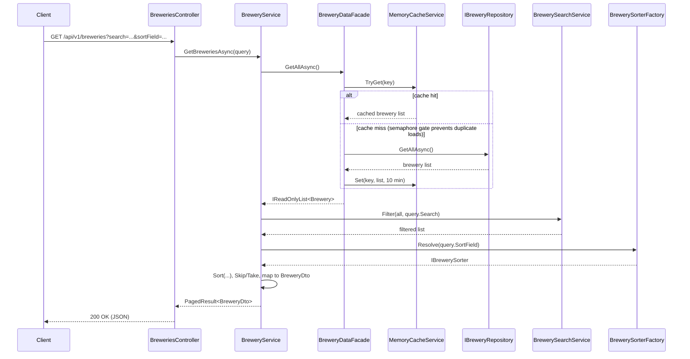

# Architecture & Design Notes

This document explains the architecture, design patterns, and trade-offs in the
Elf Brewery API — written to help prepare for a client-facing technical
round about this assignment.

## 1. High-level architecture: Clean Architecture (layered, dependency inversion)

The solution is split into four projects, each with a single responsibility.
Dependencies only point **inward** — outer layers know about inner layers,
never the other way round.

```
Elf.Brewery.Api            <-- Controllers, middleware, Swagger, startup wiring
Elf.Brewery.Infrastructure <-- EF Core, SQLite, HTTP client, JWT, caching
Elf.Brewery.Application    <-- Interfaces (contracts), DTOs, services, sorting, search
Elf.Brewery.Domain         <-- Entities, value objects, enums, exceptions (no dependencies)
```

### Diagram: layers and request flow



Dependencies only flow **inward** on the class-reference axis (Api →
Infrastructure → Application → Domain), even though at *runtime* the actual
data flow goes the other way (a request comes into the Api layer and works
its way down to Infrastructure and back up).

- **Domain** has zero project references — it only contains `Brewery` (entity),
  `GeoCoordinate` (value object), enums, and custom exceptions. This keeps
  business concepts framework-agnostic and easy to unit test.
- **Application** depends only on Domain. It defines interfaces
  (`IBreweryService`, `IBreweryRepository`, `ICacheService`, etc.) and holds
  business logic that is independent of *how* data is stored or exposed.
- **Infrastructure** depends on Application + Domain, and implements the
  interfaces: EF Core/SQLite repository, in-memory repository, HTTP client for
  Open Brewery DB, JWT token service, memory cache wrapper.
- **Api** depends on all three. It only wires things together (DI, middleware,
  controllers) and has no business logic of its own.

**Why this matters (interview angle):** this is the Dependency Inversion
Principle (the "D" in SOLID) — controllers and business logic depend on
abstractions (`IBreweryRepository`), not concrete implementations
(`SqliteBreweryRepository`). You can swap SQLite for another store, or the
Open Brewery DB HTTP client for a mock, without touching business logic.

## 2. Design patterns used

### a) Repository pattern
`IBreweryRepository` abstracts data access. Two implementations exist:
- `SqliteBreweryRepository` (EF Core + SQLite, persists across restarts)
- `InMemoryBreweryRepository` (dictionary-backed, resets on every run)

### b) Keyed dependency injection (strategy-like selection at resolve-time)
Both repository implementations, services, and facades are registered under
named keys using .NET 8's **keyed services**:

```csharp
services.AddKeyedScoped<IBreweryRepository, SqliteBreweryRepository>(BreweryStorageKeys.Sqlite);
services.AddKeyedSingleton<IBreweryRepository, InMemoryBreweryRepository>(BreweryStorageKeys.InMemory);
```

Controllers resolve a specific key via `[FromKeyedServices(...)]`, and that
same key is threaded through every layer using the `[ServiceKey]` attribute
(introduced in .NET 8) — `BreweryService` and `BreweryDataFacade` both accept
`[ServiceKey] string storageKey` in their constructor and use it to pull their
own keyed dependency from `IServiceProvider`. This lets `v1` (SQLite) and
`v2` (in-memory) run the *exact same code* against different backing stores,
without `if/else` branching or duplicated services.

### c) Facade pattern
`BreweryDataFacade` sits between the service layer and the repository. It is
responsible for:
- Reading through a cache first (`ICacheService`)
- Falling back to the repository on cache miss
- Refreshing data from the external provider and invalidating the cache

This isolates caching/refresh concerns from `BreweryService`, which only deals
with querying/paging/sorting.

### d) Strategy pattern (pluggable sorting)
Sorting is implemented as one class per sortable field:
`NameSorter`, `CitySorter`, `DistanceSorter`, all implementing `IBrewerySorter`
(exposing a `Field` and a `Sort(...)` method). Each sorter is registered as a
**keyed singleton**, keyed by its `BrewerySortField` enum value:

```csharp
services.AddKeyedSingleton<IBrewerySorter, NameSorter>(BrewerySortField.Name);
services.AddKeyedSingleton<IBrewerySorter, CitySorter>(BrewerySortField.City);
services.AddKeyedSingleton<IBrewerySorter, DistanceSorter>(BrewerySortField.Distance);
```

`BrewerySorterFactory` resolves the correct strategy at request time straight
from the keyed `IServiceProvider`, instead of building and holding its own
dictionary:

```csharp
public IBrewerySorter Resolve(BrewerySortField field) =>
    _serviceProvider.GetKeyedService<IBrewerySorter>(field)
        ?? throw new NotSupportedException($"No sorter registered for {field}");
```

**Why this matters:** adding a new sort field means adding a new class that
implements the interface and one `AddKeyedSingleton` registration — the
factory needs no changes at all. No switch statements, no if-chains, which
satisfies the Open/Closed Principle.

### e) Factory pattern
`BrewerySorterFactory` is a textbook factory — it decouples "which sorter to
use" (decided by `BreweryQuery.SortField`) from "how sorting is performed"
(delegated to the resolved `IBrewerySorter`).

### f) Cache-aside pattern with double-checked locking
`BreweryDataFacade.GetAllAsync`:
1. Try cache first.
2. On miss, acquire a `SemaphoreSlim` gate (shared across requests).
3. Re-check the cache after acquiring the lock (in case another request
   already populated it while this one was waiting).
4. Only then hit the repository, then populate the cache.

This avoids a **cache stampede** (many concurrent requests all hitting the
database when the cache is cold) while still allowing full concurrency once
the cache is warm (the semaphore is only touched on a miss).

Cache keys are namespaced per storage key
(`"breweries:all:{storageKey}"`), so v1 and v2 never share cached data.

### g) Circuit breaker + retry (resilience pattern via Polly)
The HTTP client for Open Brewery DB is configured with:
```csharp
.AddTransientHttpErrorPolicy(p => p.WaitAndRetryAsync(3, n => TimeSpan.FromMilliseconds(300 * Math.Pow(2, n))))
.AddTransientHttpErrorPolicy(p => p.CircuitBreakerAsync(5, TimeSpan.FromSeconds(30)));
```
- Retries transient failures 3 times with exponential backoff (300ms, 600ms, 1200ms).
- Trips a circuit breaker after 5 consecutive failures, breaking the circuit
  for 30 seconds (fails fast instead of hammering a downed upstream API).

### h) Global exception handling (chain of responsibility-ish, centralized mapping)
`GlobalExceptionHandler` implements ASP.NET Core's `IExceptionHandler` and
maps domain/application exceptions to HTTP status codes + RFC 7807
`ProblemDetails` responses:

| Exception | Status |
|---|---|
| `BreweryNotFoundException` | 404 |
| `ValidationException` | 400 |
| `ExternalServiceException` | 502 |
| `OperationCanceledException` | 499 (client closed request) |
| anything else | 500 |

This keeps controllers free of try/catch blocks — exceptions bubble up and
are translated in exactly one place.

### i) Middleware pattern
`CorrelationIdMiddleware` attaches/propagates a correlation ID per request,
useful for tracing a request across logs (Serilog writes to console and to
rolling daily files `logs/BreweryLog-*.log`).

### j) Mapper pattern
`BreweryMapper` implements two interfaces — `IBrewerySourceMapper` (external
API DTO -> domain entity) and `IBreweryDtoMapper` (domain entity -> API DTO).
Keeps translation logic out of services/controllers.

### k) Value Object pattern
`GeoCoordinate` is a `readonly record struct` encapsulating latitude/longitude
and the haversine distance calculation (`DistanceKmTo`). Immutable, equality
by value, no identity — classic DDD value object.

### l) Options pattern
Strongly typed configuration via `IOptions<T>`:
`CacheOptions`, `JwtOptions`, `OpenBreweryDbOptions`, `StaticUserOptions`,
bound from `appsettings.json` sections in `Program.cs`.

## 3. Cross-cutting concerns

| Concern | How it's handled |
|---|---|
| Authentication | JWT Bearer tokens (`JwtTokenService`), single hardcoded user from config for the assignment |
| Authorization | `[Authorize]` on brewery endpoints, all requiring a valid bearer token |
| API versioning | `Asp.Versioning` package; v1 and v2 share controllers logic but resolve different keyed services |
| Logging | Serilog, structured logs to console + rolling file, enriched with correlation ID |
| Error handling | Centralized via `GlobalExceptionHandler` + `ProblemDetails` |
| Health checks | `/health` endpoint via `AddHealthChecks()` |
| API docs | Swagger/Swashbuckle, one doc per API version |
| Resilience | Polly retry + circuit breaker on the external HTTP client |
| Caching | In-memory (`IMemoryCache`), 10-minute absolute expiration, high priority |

## 4. Data flow (typical GET /breweries request)

```
Controller (BreweriesController / BreweriesV2Controller)
  -> resolves IBreweryService via [FromKeyedServices]
  -> BreweryService.GetBreweriesAsync(query)
       -> BreweryDataFacade.GetAllAsync()   // cache-aside + semaphore gate
            -> ICacheService (hit?) 
            -> IBreweryRepository (miss -> Sqlite or InMemory)
       -> IBrewerySearchService.Filter(all, query.Search)
       -> IBrewerySorterFactory.Resolve(field).Sort(filtered, query)
       -> Skip/Take for paging
       -> IBreweryDtoMapper.ToDto(...) (+ optional distance calc via GeoCoordinate)
  <- PagedResult<BreweryDto>
```

### Diagram: the same request as a sequence



## 5. Testing

- **`Elf.Brewery.Application.Tests`** — unit tests (xUnit + Moq) for the pure
  business logic: `GeoCoordinate.DistanceKmTo`, each `IBrewerySorter`
  implementation, `BrewerySorterFactory`, `BreweryService`, and
  `GlobalExceptionHandler`'s exception-to-status-code mapping. No network, no
  database, no web server — fast and fully isolated.
- **`Elf.Brewery.Api.IntegrationTests`** — integration tests using
  `WebApplicationFactory<Program>`, which boots the real app (real DI, real
  middleware pipeline, real JWT auth) in-memory against an isolated temp
  SQLite file per test class. Exercises the actual HTTP surface: login
  success/failure, the 401 on missing auth, listing breweries, 404 on unknown
  id, and query validation errors.

Run everything with `dotnet test Elf.Brewery.sln`.

## 6. Project reference summary

```
Elf.Brewery.Domain          entities, enums, exceptions, GeoCoordinate (no deps)
Elf.Brewery.Application     interfaces, DTOs, service, search, sorters (-> Domain)
Elf.Brewery.Infrastructure  repositories, EF DbContext, HTTP client, JWT, caching (-> Application, Domain)
Elf.Brewery.Api             controllers, Swagger, middleware, startup (-> all)
```
